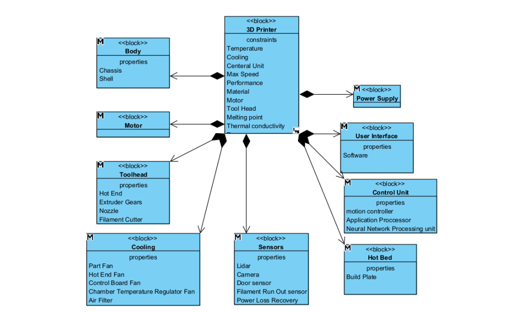
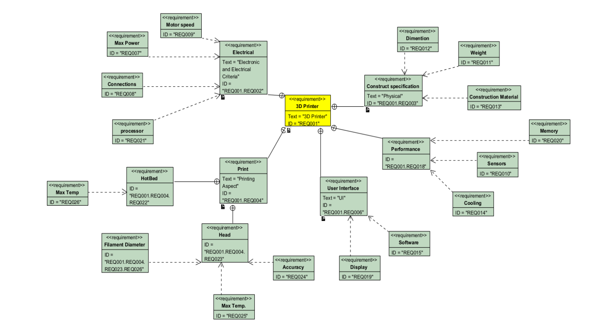

# Star if you like it ✨
This Project contains several system engineering diagrams for analysis a hole mechatronic product into SysMl language. for this purpose I use Paradigm Diagram to draw most important disgram of 3D Printer : Bambu Lab X1 Series : X1 Carbon 

  
   
  
   

